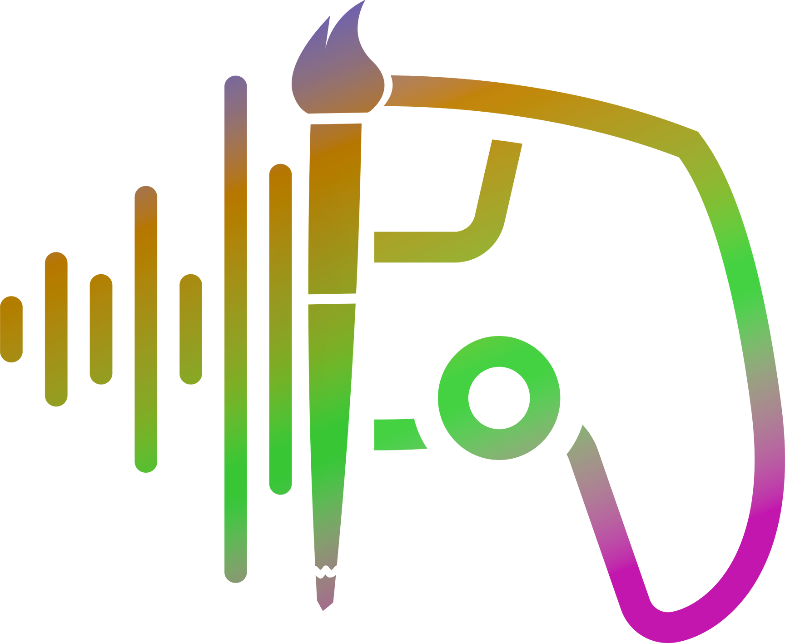

<p align="center">
  
</p>

<h1 align="center">IndieNodes Gen</h1>

<p align="center">
  Static, hosted creator pages for creators who fit the IndieNodes ring but whose current site cannot carry a Node.
</p>

<p align="center">
  <a href="https://pages.kjnet.us">Visit the pages</a> ·
  <a href="#how-it-works">How it works</a> ·
  <a href="#scope">Scope</a> ·
  <a href="#project-status">Project status</a>
</p>

## Overview

Some creators belong in the ring but cannot join it. Their work is real and public, and
the site it lives on is a service they do not control enough to add a widget to, link a
direct media file from, or shape into something a Node can point at. This repository
generates a small static page for those creators, hosted on KJNet infrastructure, so the
limits of somebody else's website stop being the reason they are not discoverable.

**A creator page is a bridge, not a home.** The creator's own site stays their primary
presence and every page links prominently back to it. A creator who needs substantially
more than the shared page system offers has outgrown the bridge, and the right answer is
their own independent site rather than more features here.

[`indienodes-app`](https://github.com/XTREEMMAK/indienodes-app) already generates creator
sites — the builder on `/join` produces a complete static site a creator downloads and
hosts themselves. This repository answers the same problem from the other side: it
produces a page KJNet hosts for them. Same problem, opposite answer to "who runs the
server." Neither replaces the other, and a creator who can host is better served by the
one that hands them the files.

## How it works

A creator is structured data first. Templates and a theme turn that data into one static
page; nothing is maintained as hand-written HTML per creator.

```text
creator data (YAML) ──> Eleventy ──> shared layouts + components ──> static HTML/CSS
                             │                                             │
                             └──────────── theme / skin ───────────────────┘
                                                                           │
                                                                           ▼
                                                            pages.kjnet.us/<creator>
```

**The content model comes from
[`indienodes-ring`](https://github.com/XTREEMMAK/indienodes-ring), not from here.** Creator
identity, type, selected works, and what each Node type is expected to carry are already
defined there, and this repository follows those definitions rather than inventing a
parallel set. Two conflicting answers to "what does a Music Node contain" is the specific
failure this rule exists to prevent.

What does belong here is presentation, which the ring deliberately has no opinion about:

```yaml
slug: jewel
name: Jewel
type: music

theme:
  skin: card
  accent: "#d7a9bc"
  backgroundImage: "/assets/jewel/background.jpg"

sections:
  about: true
  works: true
  links: true
```

A page is assembled from modular sections — hero, about, featured works, an optional
type-specific module, external links, footer — where the creator's type decides which
modules are available and the theme decides how they look. Think of it as a larger version
of the card philosophy the app already uses: structured creator content plus a few
presentation choices, producing consistent output. Arbitrary HTML and unrestricted layout
are deliberately not offered.

## Scope

The boundary matters more than the feature list, because every item in the right-hand
column is a plausible next request.

| In scope                                    | Out of scope                                |
| ------------------------------------------- | ------------------------------------------- |
| One-page creator sites                      | Accounts, dashboards, social features       |
| Static HTML and CSS, shared layouts         | A CMS or blogging platform                  |
| Configurable themes and section toggles     | An unrestricted site builder                |
| Creator assets and selected works           | Arbitrary page creation                     |
| Audio and media where the type calls for it | Database-backed or server-side user content |
| External links back to the creator's spaces | Custom domains as a managed service         |
| Simple updates to structured data           | Analytics, general-purpose hosting          |

If pressure builds for anything on the right, the question to ask is not how to build it
but whether that creator should graduate to their own site.

**Portability is a feature, not an afterthought.** Output is ordinary static HTML, CSS,
assets, and media references, with no proprietary runtime. A creator page should be easy
to export, move to another static host, put on the creator's own domain, or hand to the
creator outright to continue without KJNet.

## Repository layout

Proposed, not built — see [Project status](#project-status). Recorded here so the shape is
argued before it exists rather than discovered afterwards.

```text
src/
  _data/                      Shared and per-creator structured data
  _includes/
    layouts/                  Page shells
    components/               Hero, works, links, per-type modules
  creators/                   One structured record per creator
  assets/                     Creator images, audio, and media
  css/                        Shared styles and theme tokens
```

## Run it locally

There is nothing to run yet. Eleventy is the chosen generator and the toolchain is
deliberately unremarkable — Node.js, npm, a build script, and static output — but none of
it is scaffolded in this repository.

## Adding a creator page

Also not built yet. The intended shape is that adding a creator is a structured-data
change and nothing else: a record derived from that creator's ring entry, their assets, a
theme choice, and a build. An internal editing UI is wanted eventually, but its job is to
make that data easier to write, never to become a second renderer.

## Documentation

None yet. As decisions accumulate they belong in a `docs/` directory in this repository,
following the pattern the two sibling repositories use, with anything about what a Node
type contains staying in `indienodes-ring` where it is already settled.

## Project status

**This repository currently holds its README and nothing else.** That is deliberate: the
guiding rule from the kickoff brief is not to build infrastructure until repeated manual
work proves it is needed, and the framing above is worth agreeing on before any structure
is committed to.

The first real test is intended to be a single creator page built end to end, proving that
a ring record can populate the page, that theme options give enough visual individuality,
and that the output deploys as an ordinary static page. A second creator of a
substantially different type follows, because that is what exposes real gaps between the
ring's content model and this presentation layer.

**On the name and the hosting.** The repository sits under the IndieNodes name because the
ring is what it serves, while the pages themselves are served from KJNet infrastructure on
purpose. IndieNodes is a discovery system, not a host, and routing these pages through
`indienodes.us` would position hosting as part of the product. KJNet is neutral
infrastructure; a commercial IT identity would carry the opposite implication, that these
creators are clients and that hosting is a service being sold.

## License

IndieNodes Gen is licensed under GPL-3.0-or-later. See [`LICENSE`](./LICENSE).
